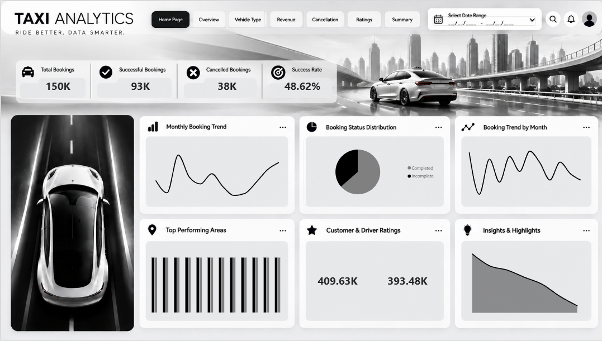
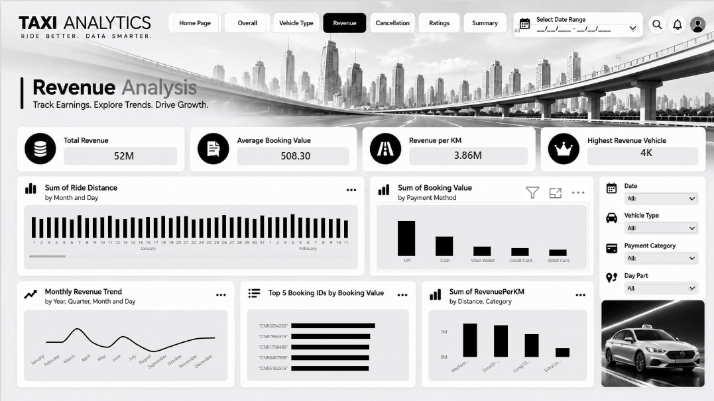
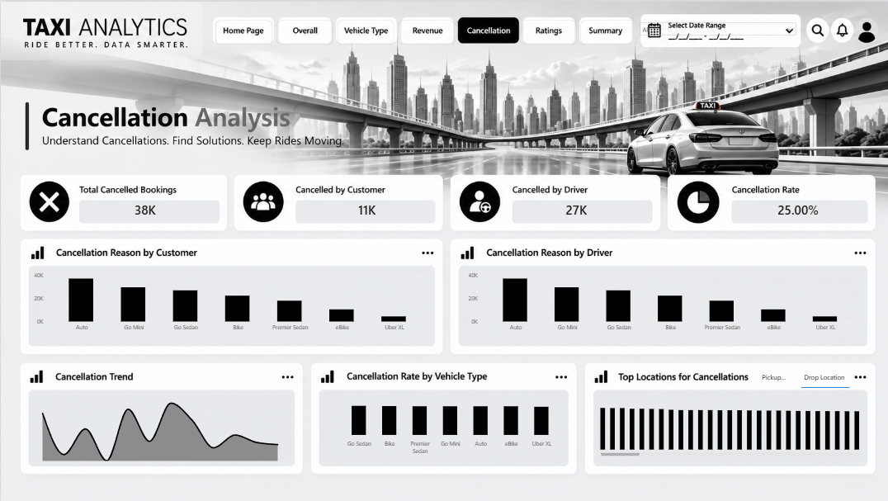
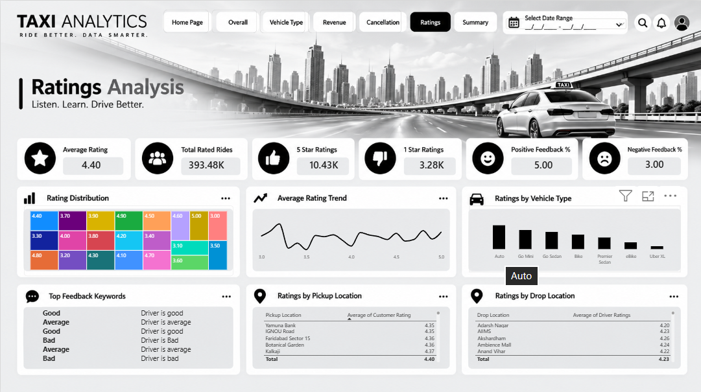
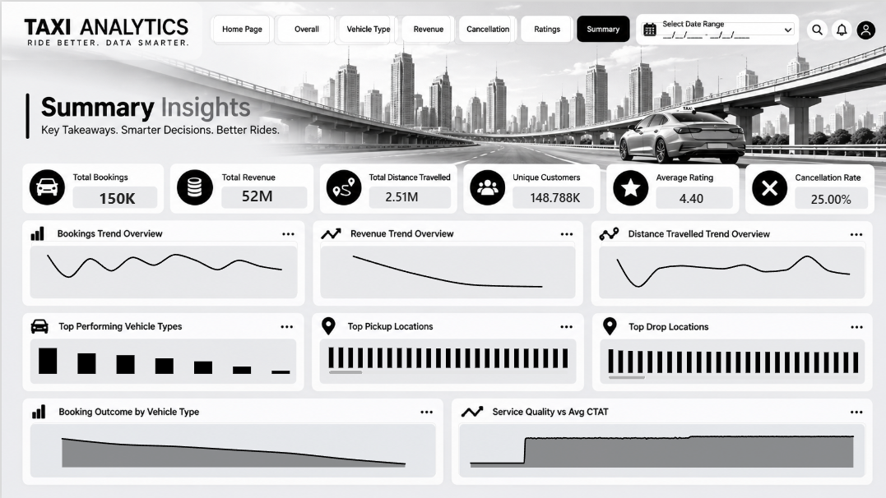

# 🚕 Taxi Analytics — Power BI Dashboard

<p align="center">


</p>

<p align="center">


</p>

---

# 📌 Project Overview

The **Taxi Analytics Dashboard** is an interactive Power BI project designed to analyze taxi booking operations, revenue, vehicle performance, cancellations, customer ratings, and booking trends.

The dashboard transforms raw taxi booking data into meaningful business insights that can support operational monitoring and data-driven decision-making.

---

# 🎯 Business Problem

Taxi businesses generate large volumes of booking and trip data, but raw data alone does not provide a clear view of operational performance.

The key business questions addressed in this project include:

- How many bookings are being generated?
- How many bookings are successfully completed?
- What is the cancellation level?
- Which vehicle types generate the highest booking volume?
- How does revenue vary across different segments?
- What are the major cancellation patterns?
- How are customers rating their taxi experience?
- How do booking trends change over time?

---

# 🎯 Project Objective

The objective of this project is to build an interactive dashboard that helps stakeholders:

- Monitor booking performance
- Analyze revenue
- Compare vehicle types
- Understand cancellation behavior
- Track customer ratings
- Identify booking trends
- Discover operational opportunities
- Support data-driven business decisions

---

# 🛠️ Tools & Technologies

| Tool | Purpose |
|---|---|
| **Power BI** | Dashboard development & visualization |
| **DAX** | Measures & analytical calculations |
| **Power Query** | Data cleaning & transformation |
| **Microsoft Excel** | Dataset |
| **Data Modeling** | Relationships & analytical structure |

---

# 📊 Dashboard Pages

The dashboard consists of **7 analytical pages**.

---

## 01 — 🏠 Home Page

Executive-level overview of the taxi business.

### Focus Areas

- Total bookings
- Successful bookings
- Cancelled bookings
- Success rate
- Booking trends
- Ratings
- Operational highlights

### Preview



---

## 02 — 📊 Overall Analysis

Provides a comprehensive view of overall booking performance and operational trends.

### Focus Areas

- Booking status distribution
- Monthly booking trends
- Top pickup locations
- Top drop locations
- Booking trends by day of week

### Preview


---

## 03 — 🚕 Vehicle Type Analysis

Compares performance across different vehicle categories.

### Focus Areas

- Booking volume
- Booking value
- Average distance travelled
- Total distance travelled
- Success rate
- Vehicle fleet performance

### Preview


---

## 04 — 💰 Revenue Analysis

Analyzes revenue performance across different booking and operational segments.

### Focus Areas

- Total revenue
- Revenue trends
- Revenue by vehicle type
- Revenue by payment method
- Revenue contribution
- Day-part analysis

### Preview



---

## 05 — ❌ Cancellation Analysis

Analyzes booking cancellations and identifies major cancellation patterns.

### Focus Areas

- Cancellation volume
- Cancellation rate
- Customer cancellations
- Driver cancellations
- Cancellation reasons
- Cancellation trends

### Preview



---

## 06 — ⭐ Ratings Analysis

Analyzes customer ratings and service experience.

### Focus Areas

- Average customer rating
- Rating distribution
- Ratings by vehicle type
- Ratings by booking category
- Customer experience trends

### Preview



---

## 07 — 📈 Summary Insights

Provides a consolidated view of the major findings from the taxi analytics project.

### Focus Areas

- Overall business performance
- Booking performance
- Revenue trends
- Vehicle performance
- Cancellation patterns
- Customer ratings
- Operational insights

### Preview



---

# 🔍 Key Business Insights

The dashboard enables analysis of several important business areas:

### 🚕 Booking Performance
Provides visibility into total bookings, successful bookings, cancellations, and booking trends.

### 💰 Revenue Performance
Helps identify revenue contribution across different vehicle and operational segments.

### 🚘 Vehicle Performance
Allows comparison of booking volume, booking value, distance travelled, and success rate across vehicle categories.

### ❌ Cancellation Behavior
Highlights cancellation patterns and helps identify areas where operational improvements may reduce lost bookings.

### ⭐ Customer Experience
Customer ratings provide an indication of service experience across different segments.

### 📅 Booking Trends
Time-based analysis helps identify changes in booking activity by month and day of week.

---

# 💡 Business Solution

Based on the analytical framework, the dashboard can help taxi businesses:

- Monitor booking performance regularly
- Identify high-performing vehicle categories
- Investigate cancellation patterns
- Improve operational efficiency
- Track revenue performance
- Monitor customer experience
- Identify changes in demand
- Support data-driven operational planning

---

# 📈 Business Impact

The dashboard provides a centralized analytical view that can help stakeholders:

- Make faster decisions
- Identify operational issues
- Track important KPIs
- Understand customer behavior
- Improve resource allocation
- Monitor revenue performance
- Identify potential growth opportunities

---

# 🧠 Analytical Capabilities

| Capability | Implementation |
|---|---|
| KPI Analysis | Power BI Cards |
| Trend Analysis | Line & Area Charts |
| Category Comparison | Bar & Column Charts |
| Geographic Analysis | Location-based visuals |
| Revenue Analysis | DAX Measures |
| Cancellation Analysis | DAX + Visual Analysis |
| Customer Analysis | Rating Analysis |
| Interactive Filtering | Slicers |
| Data Transformation | Power Query |
| Data Modeling | Power BI Relationships |

---

# 📂 Repository Structure

```text
Taxi-Analytics/
│
├── README.md
│
├── Dashboard/
│   └── Taxi_Analytics.pbix
│
├── Screenshots/
│   ├── Cancellation.png
│   ├── Home.png
│   ├── Overall analysis.png
│   ├── Ratings.png
│   ├── Revenue.png
│   ├── Summary.png
│   └── Vehicle type.png
│
├── Dataset/
│   └── Taxi_Analytics_Dataset.xlsx
│
└── DAX/
    └── DAX_Measures.txt
